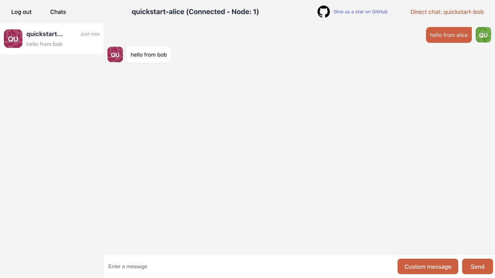
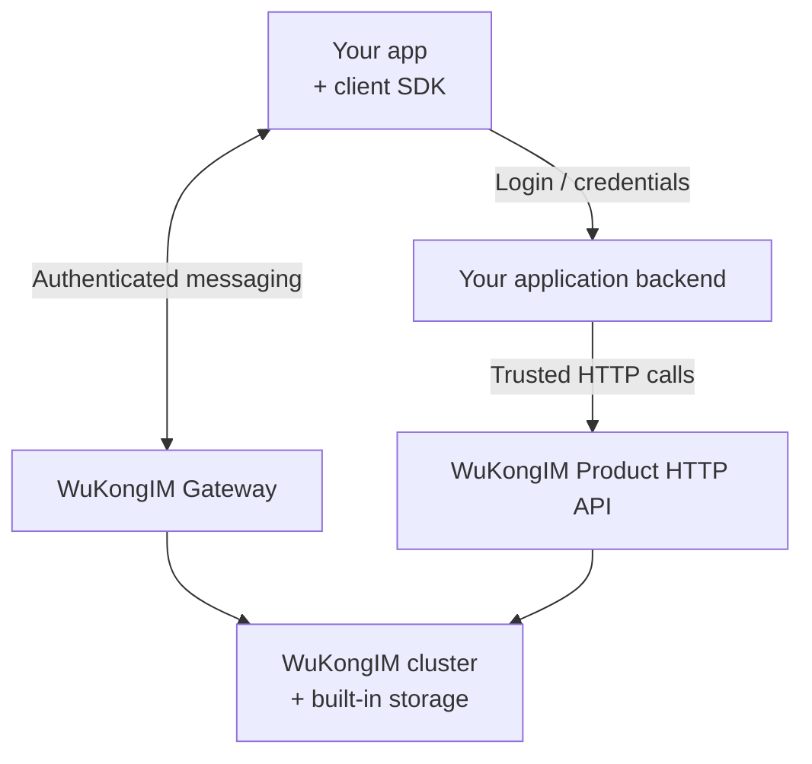

<p align="center">
  
</p>

<h1 align="center">WuKongIM</h1>

<p align="center">
  <strong>Self-hosted messaging for your app, with built-in storage and clustering.</strong>
</p>

<p align="center">
  <a href="#quick-start">Quick start</a> ·
  <a href="https://demo.githubim.com/">Live demo</a> ·
  <a href="https://docs.githubim.com/en/">Documentation</a> ·
  <a href="./README_CN.md">简体中文</a>
</p>

<p align="center">
  <a href="https://github.com/WuKongIM/WuKongIM/releases"></a>
  <a href="./LICENSE"></a>
</p>

WuKongIM is a messaging server for personal chats, groups, and application notifications. It handles message storage, synchronization, presence, and online delivery. Your application supplies the user interface, account system, and business rules.

## Why WuKongIM?

- **Fewer deployment dependencies.** Message, metadata, and replication storage are built in; the core needs no external database, cache, or message queue.
- **One cluster model.** Start with a single-node cluster and use the same messaging model in a multi-node cluster, with 256 hash slots by default.
- **Messaging building blocks.** Per-channel ordering, offline synchronization, multi-device sessions, and personal, group, or custom channels.
- **Tools included.** The embedded Chat Demo, Manager, metrics, diagnostics, and backup tools help you try and operate the service.

> [!NOTE]
> v3 is in beta. The Linux quick start uses the Preview package repository; check the installed version with `wukongim version`. APIs, configuration, and durable formats may change, so review [upgrade guidance](https://docs.githubim.com/en/server/operations/upgrade-and-migration/) before changing versions.

## Quick start

Install a single-node WuKongIM cluster on a Linux server and exchange messages between two test users. The package repository supports **amd64/x86_64**: Ubuntu 24.04, Debian 13, Rocky Linux 9, AlmaLinux 9, and RHEL 9. You need systemd, sudo, curl, and SSH access from your computer. No Go installation is required.

Run steps 1–3 **on the Linux server**. The generated configuration binds services to loopback; use SSH forwarding to open the Demo and Manager from your computer.

### 1. Install the package

On **Ubuntu / Debian**:

```bash
curl -fsSL https://packages.githubim.com/repo | sudo sh
sudo apt update
sudo apt install -y wukongim
```

<details>
<summary>Rocky Linux / AlmaLinux / RHEL 9</summary>

```bash
curl -fsSL https://packages.githubim.com/repo | sudo sh
sudo dnf -y --disablerepo='*' --enablerepo=wukongim-preview makecache --refresh
sudo dnf install -y wukongim
```

</details>

Check the installed version:

```bash
wukongim version
```

### 2. Initialize configuration

```bash
sudo wukongim init
sudo wukongim config validate --config /etc/wukongim/wukongim.toml
```

Save the Manager administrator password printed during initialization; it is shown only once. Configuration is stored at `/etc/wukongim/wukongim.toml`.

### 3. Start and check readiness

```bash
sudo systemctl enable --now wukongim
curl --retry 30 --retry-delay 2 --retry-all-errors --max-time 5 --fail \
  http://127.0.0.1:5001/readyz
```

Wait for `{"ready":true}` before continuing.

### 4. Open the Demo and Manager

For a remote server, run this **on your computer**, replacing `user@server-ip` with your SSH login, and keep the terminal open:

```bash
ssh -N \
  -L 127.0.0.1:5001:127.0.0.1:5001 \
  -L 127.0.0.1:5200:127.0.0.1:5200 \
  -L 127.0.0.1:5301:127.0.0.1:5301 \
  user@server-ip
```

If your browser runs on the Linux server itself, skip the tunnel. Open:

| Application | Address | Login |
| --- | --- | --- |
| English Chat Demo | <http://127.0.0.1:5001/demo/?lang=en> | Test users below |
| Manager | <http://127.0.0.1:5301> | `admin` / the password saved during initialization |

### 5. Send and receive the first message

The English UI and `?lang=en` are included in the current development build. Older packages and the hosted demo may still show Chinese until they are updated. The steps and screenshot below use the English UI.

1. Open Chat Demo in **two separate browser sessions**, such as a normal window and a private window. Keep **API base URL** at `http://127.0.0.1:5001`.
2. Enter the following credentials. **Fill in both Account and Password**; the password is a test connection token, and no account registration is needed.

   | Session | Account (UID) | Password / test token |
   | --- | --- | --- |
   | Alice | `quickstart-alice` | `alice-local-token` |
   | Bob | `quickstart-bob` | `bob-local-token` |

3. Click **Log in** and wait for both pages to show **Connected**. On Alice's page, click **Start a chat**, select **Direct chat**, enter `quickstart-bob`, and click **OK**. On Bob's page, select `quickstart-alice` the same way.
4. On Alice's page, enter `hello from alice` and click **Send**. Confirm it appears on **Bob's page**, then have Bob reply with `hello from bob`.
5. Confirm Alice receives the reply. You have verified connection, sending, and online delivery in both directions.

The Demo registers test tokens directly through `/user/token`. In your application, a trusted backend must own identity checks and token issuance; clients must not register or reset their own tokens.

<details>
<summary>Troubleshooting and stopping the demo</summary>

If readiness fails, inspect the service logs. If a client stays disconnected, check that its token is non-empty, the API address is correct, and the SSH tunnel forwards port `5200`. If messages do not arrive, check both connection states and the recipient UID.

Run these commands on the Linux server:

```bash
sudo journalctl -u wukongim -n 100 --no-pager
sudo systemctl stop wukongim
sudo systemctl start wukongim
```

Stop when finished; start the same service to resume. Messages remain in `/var/lib/wukongim`. See the [Linux deployment guide](https://docs.githubim.com/en/server/deployment/linux/) for package and service details.

</details>

<p align="center">
  
</p>

## Connect your application

Start with the [JavaScript / Web quickstart](https://docs.githubim.com/en/sdk/javascript/quickstart/): its runnable example includes a development backend, two client sessions, and offline recovery. Then replace the development backend with your own authenticated application backend.



| WuKongIM provides | Your application owns |
| --- | --- |
| Messaging connections, channel message storage, replication, and online delivery | Account login, token issuance, and access to Product HTTP |
| Channel and subscriber APIs, synchronization APIs | Business permissions, group/friend workflows, and SDK synchronization providers |
| Client SDKs, webhooks, and plugin interfaces | Product UI, media storage, and application-specific behavior |

**Product HTTP has no built-in business caller authentication.** Keep it behind your trusted backend or an authenticated API gateway. Manager login protects Manager, not Product HTTP. A successful send confirms the server send result; recipient delivery and processing are separate events. Offline recovery requires client synchronization.

### Choose an SDK

| Your integration needs | Start here |
| --- | --- |
| Chat state, conversations, unread counts, and offline recovery | [WuKongIMSDK](https://docs.githubim.com/en/sdk/wukongim/) — Android, iOS, JavaScript/Web, Flutter, HarmonyOS |
| Lightweight online connections and send/receive | [WuKongEasySDK](https://docs.githubim.com/en/sdk/easy/) — Android, iOS, JavaScript/Web, Flutter |

Use the [SDK selector](https://docs.githubim.com/en/sdk/) for the maintained versions and platform guides. The old standalone UniApp SDK is no longer maintained; use the [JavaScript / UniApp migration guide](https://docs.githubim.com/en/sdk/javascript/advanced/offline-and-uniapp/).

## Operate and evaluate

The embedded Manager shows cluster state, connections, channels, messages, diagnostics, and backups.

<p align="center">
  
</p>

- **Deploy:** [Linux packages](https://docs.githubim.com/en/server/deployment/linux/), [Docker](https://docs.githubim.com/en/server/deployment/docker/), and [multi-node clusters](https://docs.githubim.com/en/server/deployment/multi-node/).
- **Prepare for production:** replace example credentials, configure [security and network access](https://docs.githubim.com/en/server/configuration/security/), and exercise [backup and restore](https://docs.githubim.com/en/server/operations/backup-and-restore/).
- **Understand the system:** [architecture](https://docs.githubim.com/en/server/architecture/) and [operations tools](https://docs.githubim.com/en/server/tools/).

To evaluate performance, read the [conversation and messaging performance report](./docs/superpowers/reports/2026-08-06-membership-conversation-performance-acceptance.md) for workloads, revisions, latency, and limits. Its results apply to the historical three-process, single-host setup documented there. Measure your own version and workload with [`wkbench`](./cmd/wkbench/README.md) and the [performance runbook](./docs/development/PERF_TRIAGE.md).

## Development and community

For source development, clone this repository and follow the [configuration and startup guide](https://docs.githubim.com/en/server/configuration/). The repository uses Go `1.25.11`.

```bash
GOWORK=off go build ./cmd/wukongim ./cmd/wkcli ./cmd/wkbench ./cmd/wkdb
GOWORK=off go test ./cmd/... ./internal/... ./pkg/... ./scripts/... ./docker/... -count=1
```
See [repository conventions](./AGENTS.md) and [CI](./docs/development/CI.md). For frontend changes, follow the [Manager](./web/README.md) and [Chat Demo](./demo/chatdemo/README.md) build guides; their generated assets are embedded in the Go binary and must be rebuilt and committed when changed.

[Website](https://githubim.com) · [Documentation](https://docs.githubim.com/en/) · [Issues](https://github.com/WuKongIM/WuKongIM/issues) · [Releases](https://github.com/WuKongIM/WuKongIM/releases)

WeChat: `wukongimgo` — ask to join the WuKongIM community group.

Licensed under the [Apache License 2.0](./LICENSE).
