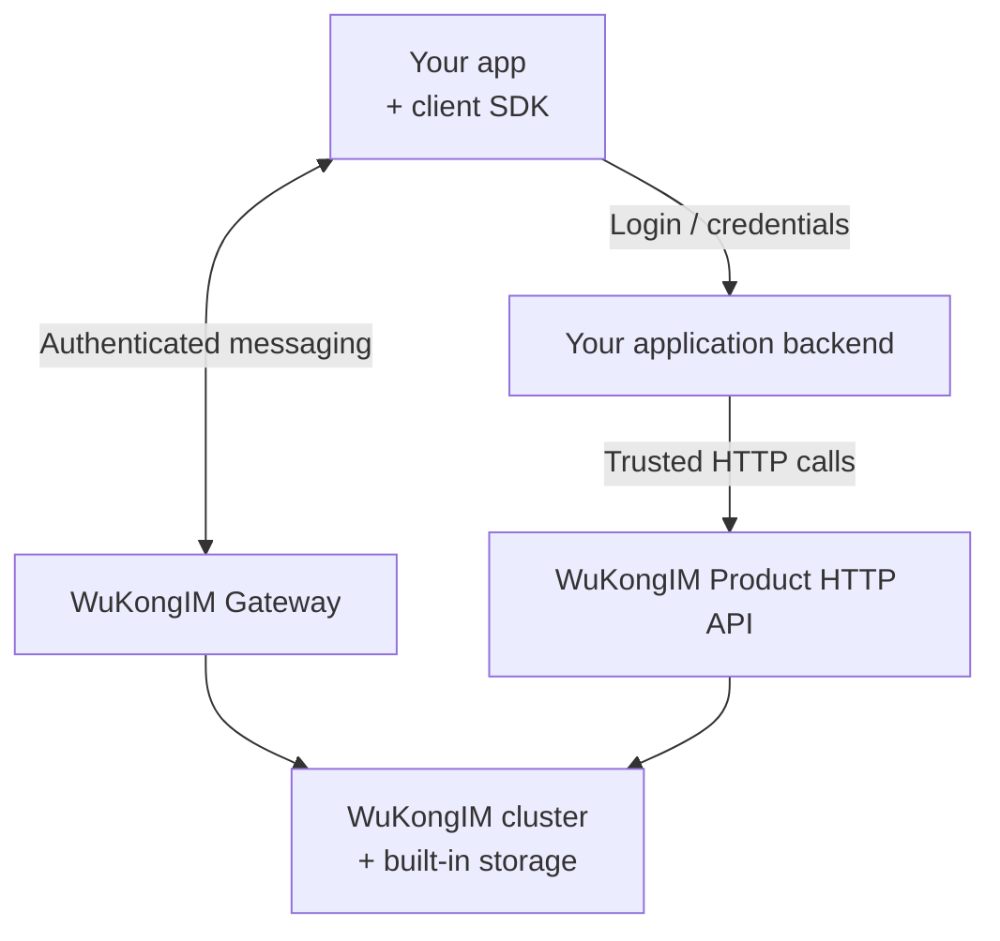

<p align="center">
  
</p>

<h1 align="center">WuKongIM</h1>

<p align="center">
  <strong>Self-hosted messaging for your app, with built-in storage and clustering.</strong>
</p>

<p align="center">
  <a href="#quick-start">Quick start</a> ·
  <a href="https://demo.githubim.com/">Live demo</a> ·
  <a href="https://docs.githubim.com/en/">Documentation</a> ·
  <a href="./README_CN.md">简体中文</a>
</p>

<p align="center">
  <a href="https://github.com/WuKongIM/WuKongIM/releases"></a>
  <a href="./LICENSE"></a>
</p>

WuKongIM is a messaging server for personal chats, groups, and application notifications. It handles message storage, synchronization, presence, and online delivery. Your application supplies the user interface, account system, and business rules.

## Why WuKongIM?

- **Fewer deployment dependencies.** Message, metadata, and replication storage are built in; the core needs no external database, cache, or message queue.
- **One cluster model.** Start with a single-node cluster and use the same messaging model in a multi-node cluster, with 256 hash slots by default.
- **Messaging building blocks.** Per-channel ordering, offline synchronization, multi-device sessions, and personal, group, or custom channels.
- **Tools included.** The embedded Chat Demo, Manager, metrics, diagnostics, and backup tools help you try and operate the service.

> [!NOTE]
> v3 is in beta. The quick start below pins [v3.0.0-beta.8](https://github.com/WuKongIM/WuKongIM/releases/tag/v3.0.0-beta.8). APIs, configuration, and durable formats may change; review [upgrade guidance](https://docs.githubim.com/en/server/operations/upgrade-and-migration/) before changing versions.

## Quick start

Run a single-node cluster on your computer and exchange messages between two test users. You need a running Docker engine, a POSIX shell, and curl with `--retry-all-errors` support. No repository clone or Go installation is required.

This example uses public test credentials and binds every published port to `127.0.0.1`. For a remote server, use the [Docker deployment guide](https://docs.githubim.com/en/server/deployment/docker/).

### 1. Create the configuration

```bash
mkdir -p wukongim-quickstart
cd wukongim-quickstart

cat > wukongim.toml <<'EOF'
[node]
id = 1
data_dir = "/var/lib/wukongim"

[cluster]
listen_addr = "127.0.0.1:7001"

[api]
listen_addr = "0.0.0.0:5001"
external_tcp_addr = "127.0.0.1:5100"
external_ws_addr = "ws://127.0.0.1:5200"

[gateway]
token_auth_on = true

[manager]
listen_addr = "0.0.0.0:5301"
auth_on = true
jwt_secret = "readme-demo-only-change-before-production"
users = [{ username = "admin", password = "readme-demo-admin", permissions = [{ resource = "*", actions = ["*"] }] }]

[log]
dir = "/var/lib/wukongim/logs"
EOF
```
On **Linux**, grant the image's non-root group (`10001`) read access to this file:

```bash
sudo chown "$(id -u):10001" wukongim.toml
chmod 0640 wukongim.toml
```
For rootless Docker or user-namespace mappings, follow the [configuration permission guidance](https://docs.githubim.com/en/server/deployment/docker/#set-the-configuration-file-permissions-on-linux-hosts).

### 2. Start and check readiness

```bash
docker run -d --name wukongim-quickstart \
  -p 127.0.0.1:5001:5001 -p 127.0.0.1:5100:5100 \
  -p 127.0.0.1:5200:5200 -p 127.0.0.1:5301:5301 \
  -v "$PWD/wukongim.toml:/etc/wukongim/wukongim.toml:ro" \
  -v wukongim-quickstart-data:/var/lib/wukongim \
  ghcr.io/wukongim/wukongim:3.0.0-beta.8

curl --retry 30 --retry-delay 2 --retry-all-errors --max-time 5 --fail \
  http://127.0.0.1:5001/readyz
```
Wait for `{"ready":true}`, then open:

| Application | Address | Login |
| --- | --- | --- |
| Chat Demo | <http://127.0.0.1:5001/demo/> | Test users below |
| Manager | <http://127.0.0.1:5301> | `admin` / `readme-demo-admin` |

### 3. Send and receive the first message

1. Open Chat Demo in **two separate browser sessions**, such as a normal window and a private window. Keep the API address at `http://127.0.0.1:5001`.
2. Sign in with the following credentials. **Fill in both UID and password**; the password is a test connection token, not an existing account password.

   | Session | UID (登录账号) | Password / test token (登录密码) |
   | --- | --- | --- |
   | Alice | `quickstart-alice` | `alice-local-token` |
   | Bob | `quickstart-bob` | `bob-local-token` |

3. Click **登录** (sign in) and wait for both pages to show **连接成功** (connected). On Alice's page, click **与谁会话？** in the top-right corner, select **单聊** (direct chat), enter `quickstart-bob`, and click **确定** (confirm). On Bob's page, select `quickstart-alice` the same way.
4. On Alice's page, enter `hello from alice` and click **发送** (send). Confirm it appears on **Bob's page**, then have Bob reply with `hello from bob`.
5. Confirm Alice receives the reply. You have verified connection, sending, and online delivery in both directions.

The Demo registers test tokens directly through `/user/token`. In your application, a trusted backend must own identity checks and token issuance; clients must not register or reset their own tokens.

<details>
<summary>Troubleshooting and stopping the demo</summary>

If readiness fails, inspect the container logs. If a client stays disconnected, check that its token is non-empty, the API address is correct, and port `5200` is available. If messages do not arrive, check both connection states and the recipient UID.

```bash
docker logs --tail 100 wukongim-quickstart
docker stop wukongim-quickstart
docker start wukongim-quickstart
```
Stop when finished; start the same container to resume. Messages remain in the `wukongim-quickstart-data` Docker volume. See the [Docker guide](https://docs.githubim.com/en/server/deployment/docker/) for complete removal or recreating the container with a different configuration.

</details>

<p align="center">
  
</p>

## Connect your application

Start with the [JavaScript / Web quickstart](https://docs.githubim.com/en/sdk/javascript/quickstart/): its runnable example includes a development backend, two client sessions, and offline recovery. Then replace the development backend with your own authenticated application backend.



| WuKongIM provides | Your application owns |
| --- | --- |
| Messaging connections, channel message storage, replication, and online delivery | Account login, token issuance, and access to Product HTTP |
| Channel and subscriber APIs, synchronization APIs | Business permissions, group/friend workflows, and SDK synchronization providers |
| Client SDKs, webhooks, and plugin interfaces | Product UI, media storage, and application-specific behavior |

**Product HTTP has no built-in business caller authentication.** Keep it behind your trusted backend or an authenticated API gateway. Manager login protects Manager, not Product HTTP. A successful send confirms the server send result; recipient delivery and processing are separate events. Offline recovery requires client synchronization.

### Choose an SDK

| Your integration needs | Start here |
| --- | --- |
| Chat state, conversations, unread counts, and offline recovery | [WuKongIMSDK](https://docs.githubim.com/en/sdk/wukongim/) — Android, iOS, JavaScript/Web, Flutter, HarmonyOS |
| Lightweight online connections and send/receive | [WuKongEasySDK](https://docs.githubim.com/en/sdk/easy/) — Android, iOS, JavaScript/Web, Flutter |

Use the [SDK selector](https://docs.githubim.com/en/sdk/) for the maintained versions and platform guides. The old standalone UniApp SDK is no longer maintained; use the [JavaScript / UniApp migration guide](https://docs.githubim.com/en/sdk/javascript/advanced/offline-and-uniapp/).

## Operate and evaluate

The embedded Manager shows cluster state, connections, channels, messages, diagnostics, and backups.

<p align="center">
  
</p>

- **Deploy:** [Linux packages](https://docs.githubim.com/en/server/deployment/linux/), [Docker](https://docs.githubim.com/en/server/deployment/docker/), and [multi-node clusters](https://docs.githubim.com/en/server/deployment/multi-node/).
- **Prepare for production:** replace example credentials, configure [security and network access](https://docs.githubim.com/en/server/configuration/security/), and exercise [backup and restore](https://docs.githubim.com/en/server/operations/backup-and-restore/).
- **Understand the system:** [architecture](https://docs.githubim.com/en/server/architecture/) and [operations tools](https://docs.githubim.com/en/server/tools/).

To evaluate performance, read the [conversation and messaging performance report](./docs/superpowers/reports/2026-08-06-membership-conversation-performance-acceptance.md) for workloads, revisions, latency, and limits. Its results apply to the historical three-process, single-host setup documented there. Measure your own version and workload with [`wkbench`](./cmd/wkbench/README.md) and the [performance runbook](./docs/development/PERF_TRIAGE.md).

## Development and community

For source development, clone this repository and follow the [configuration and startup guide](https://docs.githubim.com/en/server/configuration/). The repository uses Go `1.25.11`.

```bash
GOWORK=off go build ./cmd/wukongim ./cmd/wkcli ./cmd/wkbench ./cmd/wkdb
GOWORK=off go test ./cmd/... ./internal/... ./pkg/... ./scripts/... ./docker/... -count=1
```
See [repository conventions](./AGENTS.md) and [CI](./docs/development/CI.md). For frontend changes, follow the [Manager](./web/README.md) and [Chat Demo](./demo/chatdemo/README.md) build guides; their generated assets are embedded in the Go binary and must be rebuilt and committed when changed.

[Website](https://githubim.com) · [Documentation](https://docs.githubim.com/en/) · [Issues](https://github.com/WuKongIM/WuKongIM/issues) · [Releases](https://github.com/WuKongIM/WuKongIM/releases)

WeChat: `wukongimgo` — ask to join the WuKongIM community group.

Licensed under the [Apache License 2.0](./LICENSE).
