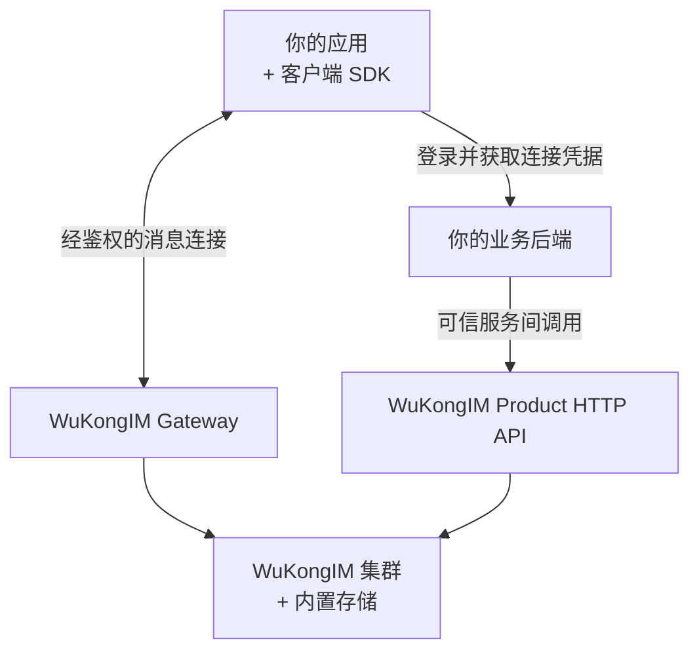

<p align="center">
  
</p>

<h1 align="center">WuKongIM</h1>

<p align="center">
  <strong>为应用提供可自托管的即时通信服务，内置存储与集群能力。</strong>
</p>

<p align="center">
  <a href="#快速开始">快速开始</a> ·
  <a href="https://demo.githubim.com/">在线体验</a> ·
  <a href="https://docs.githubim.com/zh/">文档</a> ·
  <a href="./README.md">English</a>
</p>

<p align="center">
  <a href="https://github.com/WuKongIM/WuKongIM/releases"></a>
  <a href="./LICENSE"></a>
</p>

WuKongIM 是面向单聊、群聊和应用通知的消息服务器，负责消息存储、同步、在线状态与在线投递。应用界面、账号体系和业务规则由你的应用提供。

## 为什么选择 WuKongIM？

- **部署依赖少。** 内置消息、元数据和复制日志存储，通信核心无需外部数据库、缓存或消息队列。
- **统一的集群模型。** 从单节点集群开始，多节点集群沿用相同的消息模型，默认采用 256 个 Hash Slot。
- **完整的消息基础能力。** 支持频道内有序消息、离线同步、多设备会话，以及个人、群组和自定义频道。
- **自带体验与运维工具。** 内嵌聊天 Demo、Manager、指标、诊断和备份工具，便于试用和运维。

> [!NOTE]
> v3 目前处于 beta 阶段。Linux 快速开始使用 Preview 软件源，请通过 `wukongim version` 确认安装版本。API、配置和持久化格式仍可能变化，更换版本前请阅读[升级指南](https://docs.githubim.com/zh/server/operations/upgrade-and-migration/)。

## 快速开始

使用 Docker 部署请参阅 [Docker 部署指南](https://docs.githubim.com/zh/server/deployment/docker/)。

在 Linux 服务器上安装 WuKongIM 单节点集群，让两个测试用户互发消息。软件源支持 **amd64/x86_64**：Ubuntu 24.04、Debian 13、Rocky Linux 9、AlmaLinux 9 和 RHEL 9。需要 systemd、sudo、curl，以及从自己电脑连接服务器的 SSH 权限，无需安装 Go。

第 1–3 步均在 **Linux 服务器上**执行。初始化生成的配置只监听回环地址，通过 SSH 转发即可在自己电脑上打开 Demo 和 Manager。

### 1. 安装软件包

**Ubuntu / Debian**：

```bash
curl -fsSL https://packages.githubim.com/repo | sudo sh
sudo apt update
sudo apt install -y wukongim
```

<details>
<summary>Rocky Linux / AlmaLinux / RHEL 9</summary>

```bash
curl -fsSL https://packages.githubim.com/repo | sudo sh
sudo dnf -y --disablerepo='*' --enablerepo=wukongim-preview makecache --refresh
sudo dnf install -y wukongim
```

</details>

检查安装版本：

```bash
wukongim version
```

### 2. 初始化配置

```bash
sudo wukongim init
sudo wukongim config validate --config /etc/wukongim/wukongim.toml
```

保存初始化时输出的 Manager 管理员密码，它只显示一次。配置文件位于 `/etc/wukongim/wukongim.toml`。

### 3. 启动并检查就绪状态

```bash
sudo systemctl enable --now wukongim
curl --retry 30 --retry-delay 2 --retry-all-errors --max-time 5 --fail \
  http://127.0.0.1:5001/readyz
```

等待返回 `{"ready":true}` 后再继续。

### 4. 打开 Demo 和 Manager

如果使用远程服务器，在**自己的电脑上**执行以下命令，将 `user@server-ip` 替换为实际 SSH 登录信息，并保持终端开启：

```bash
ssh -N \
  -L 127.0.0.1:5001:127.0.0.1:5001 \
  -L 127.0.0.1:5200:127.0.0.1:5200 \
  -L 127.0.0.1:5301:127.0.0.1:5301 \
  user@server-ip
```

如果浏览器就在 Linux 服务器上运行，可以跳过隧道。打开：

| 应用 | 地址 | 登录方式 |
| --- | --- | --- |
| 聊天 Demo | <http://127.0.0.1:5001/demo/> | 使用下方测试用户 |
| Manager | <http://127.0.0.1:5301> | `admin` / 初始化时保存的密码 |

### 5. 完成第一次双向收发

1. 使用**两个独立的浏览器会话**打开聊天 Demo，例如普通窗口和无痕窗口。API 地址保持为 `http://127.0.0.1:5001`。
2. 使用下表中的凭据登录。**UID 和密码都必须填写**；这里的密码是测试连接 Token，无需提前注册账号。

   | 会话 | UID | 密码 / 测试 Token |
   | --- | --- | --- |
   | Alice | `quickstart-alice` | `alice-local-token` |
   | Bob | `quickstart-bob` | `bob-local-token` |

3. 点击**登录**，等待两个页面均显示**连接成功**。在 Alice 页面点击右上角的**与谁会话？**，选择**单聊**，填写 `quickstart-bob` 并点击**确定**。在 Bob 页面以同样方式选择 `quickstart-alice`。
4. 在 Alice 页面输入 `hello from alice` 并点击**发送**，确认消息出现在 **Bob 的页面**。然后让 Bob 回复 `hello from bob`。
5. 确认 Alice 收到回复，即完成连接、发送和在线投递的双向验证。

Demo 会直接通过 `/user/token` 注册测试 Token。接入自己的应用时，身份验证和 Token 签发必须由可信业务后端负责，客户端不能自行注册或重置 Token。

<details>
<summary>排查问题与停止体验</summary>

就绪检查失败时，先查看服务日志。客户端一直未连接时，检查 Token 是否非空、API 地址是否正确，以及 SSH 隧道是否转发了端口 `5200`。消息未到达时，检查双方连接状态和接收方 UID。

在 Linux 服务器上执行：

```bash
sudo journalctl -u wukongim -n 100 --no-pager
sudo systemctl stop wukongim
sudo systemctl start wukongim
```

体验结束后停止服务，下次启动同一服务即可继续。消息保存在 `/var/lib/wukongim`，软件包与服务的详细说明见 [Linux 部署指南](https://docs.githubim.com/zh/server/deployment/linux/)。

</details>

<p align="center">
  
</p>

## 接入自己的应用

从 [JavaScript / Web 快速接入](https://docs.githubim.com/zh/sdk/javascript/quickstart/)开始：可运行示例包含开发用后端、两个客户端会话和离线恢复流程。跑通后，用自己的身份认证与业务后端替换开发示例。



| WuKongIM 提供 | 你的应用负责 |
| --- | --- |
| 消息连接、频道消息存储、复制和在线投递 | 账号登录、Token 签发和 Product HTTP 访问控制 |
| 频道与订阅者 API、同步 API | 业务权限、群组与好友流程、SDK 同步 Provider |
| 客户端 SDK、Webhook 和插件接口 | 产品界面、媒体存储和具体业务逻辑 |

**Product HTTP 没有内置的业务调用方认证。** 请将它放在可信业务后端或带认证的 API 网关之后。Manager 登录只保护 Manager，不保护 Product HTTP。发送成功表示服务端返回了发送结果；对方收到和处理消息是不同阶段，离线恢复还需要客户端发起同步。

### 选择 SDK

| 接入需求 | 从这里开始 |
| --- | --- |
| 聊天状态、会话列表、未读数和离线恢复 | [WuKongIMSDK](https://docs.githubim.com/zh/sdk/wukongim/) — Android、iOS、JavaScript/Web、Flutter、HarmonyOS |
| 轻量的在线连接与消息收发 | [WuKongEasySDK](https://docs.githubim.com/zh/sdk/easy/) — Android、iOS、JavaScript/Web、Flutter |

维护中的版本和各平台教程见 [SDK 选型](https://docs.githubim.com/zh/sdk/)。旧的独立 UniApp SDK 已停止维护，请使用 [JavaScript / UniApp 迁移指南](https://docs.githubim.com/zh/sdk/javascript/advanced/offline-and-uniapp/)。

## 运维与评估

内嵌 Manager 提供集群状态、连接、频道、消息、诊断和备份视图。

<p align="center">
  
</p>

- **部署：** [Linux 软件包](https://docs.githubim.com/zh/server/deployment/linux/)、[Docker](https://docs.githubim.com/zh/server/deployment/docker/)和[多节点集群](https://docs.githubim.com/zh/server/deployment/multi-node/)。
- **准备生产环境：** 替换示例凭据，配置[安全与网络访问控制](https://docs.githubim.com/zh/server/configuration/security/)，并演练[备份与恢复](https://docs.githubim.com/zh/server/operations/backup-and-restore/)。
- **理解系统：** [架构说明](https://docs.githubim.com/zh/server/architecture/)与[运维工具](https://docs.githubim.com/zh/server/tools/)。

评估性能时，从[会话与消息性能报告](./docs/superpowers/reports/2026-08-06-membership-conversation-performance-acceptance.md)开始，查看负载、代码版本、延迟与限制。结果适用于报告记录的历史版本及单台主机、三个进程的测试环境。请使用 [`wkcli bench`](./cmd/wkcli/internal/benchmark/README.md) 和[性能排查手册](./docs/development/PERF_TRIAGE.md)测量自己的版本和业务负载。

## 开发与社区

从源码开发时，克隆本仓库后参照[配置与启动指南](https://docs.githubim.com/zh/server/configuration/)。仓库使用 Go `1.25.11`。

```bash
GOWORK=off go build ./cmd/wukongim ./cmd/wkcli
GOWORK=off go test ./cmd/... ./internal/... ./pkg/... ./scripts/... ./docker/... -count=1
```
请阅读[仓库约定](./AGENTS.md)和 [CI 说明](./docs/development/CI.md)。修改前端时，按 [Manager](./web/README.md) 和[聊天 Demo](./demo/chatdemo/README.md) 的指南构建；生成的静态资源会嵌入 Go 二进制，变更后需要重新构建并提交。

[官网](https://githubim.com) · [文档](https://docs.githubim.com/zh/) · [问题反馈](https://github.com/WuKongIM/WuKongIM/issues) · [发布版本](https://github.com/WuKongIM/WuKongIM/releases)

微信：`wukongimgo`，请注明加入 WuKongIM 技术交流群。

采用 [Apache License 2.0](./LICENSE) 开源许可证。
