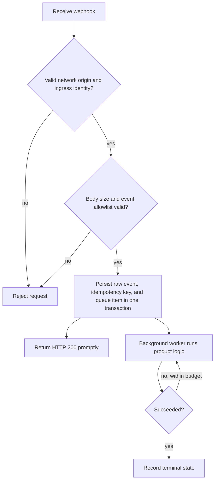

Webhooks support synchronous business decisions before sending and asynchronous notifications for committed messages, offline recipients, and presence changes. The business service receives callbacks over HTTP.

## Before-send business callback

`msg.before_send` runs synchronously after permission checks and Send plugins, before message submission. It defaults to disabled and is independent of asynchronous Webhook `http_addr`, `focus_events`, and plugin enablement. Configure every sending ingress node consistently; changes require a restart.

```toml
[webhook.before_send]
enabled = true
http_addr = "https://business.example.com/im/webhook"
timeout = "500ms"
on_timeout = "deny"
on_error = "deny"
max_in_flight = 256
```

Environment overrides are `WK_WEBHOOK_BEFORE_SEND_ENABLED`, `WK_WEBHOOK_BEFORE_SEND_HTTP_ADDR`, `WK_WEBHOOK_BEFORE_SEND_TIMEOUT`, `WK_WEBHOOK_BEFORE_SEND_ON_TIMEOUT`, `WK_WEBHOOK_BEFORE_SEND_ON_ERROR`, and `WK_WEBHOOK_BEFORE_SEND_MAX_IN_FLIGHT`. The URL must use HTTP(S), without userinfo or a fragment.

```http
POST /im/webhook?event=msg.before_send
Content-Type: application/json
```

```json
{
  "from_uid": "u1",
  "channel_id": "group1",
  "channel_type": 2,
  "client_msg_no": "business-message-001",
  "payload": "aGVsbG8=",
  "no_persist": false,
  "sync_once": false
}
```

`channel_id` identifies the canonical source channel: person channels use the server-normalized identity, SyncOnce uses the source rather than internal command channel, and request-scoped `subscribers` use the stable temporary source channel derived from that recipient snapshot. No committed `message_id` or `message_seq` exists yet. Payloads use Base64. Each group message invokes one callback per ingress send attempt, independent of member count; authority forwarding does not repeat it.

Return HTTP 200 with one explicit JSON decision:

| Outcome | Response |
| --- | --- |
| Allow unchanged | `{"allow":true}` |
| Allow replacement | `{"allow":true,"payload":"bmV3"}` |
| Standard rejection | `{"allow":false}` |
| Business rejection code | `{"allow":false,"reason_code":200}` |

`allow` is required. Only Payload can change; identity and routing fields remain immutable. Omit `payload` to preserve the input. A replacement must be valid Base64 decoding to 1–32767 bytes. The response is limited to 64 KiB and one JSON object; unknown or duplicate fields, missing decisions, trailing JSON, and invalid field types in allow responses are callback errors. Business codes 128–255 retain their values in SENDACK `reason_code` and Product HTTP `reason`, independently of HTTP status. A decoded denial with an omitted or invalid rejection code returns standard NotAllowSend (11); an inapplicable Payload on a denial also remains a denial.

| Condition | Behavior |
| --- | --- |
| Explicit business denial | Always reject, without message submission or delivery |
| Callback timeout | `on_timeout`: `allow` keeps the pre-callback Payload; `deny` returns SystemError (15) |
| Network failure, non-200 status, or no parseable decision | `on_error`: `allow` keeps the input; `deny` returns SystemError (15) |
| `max_in_flight` reached | Immediately return SystemError (15), without another waiting queue |
| Original send canceled or expired | Stop; failure-open policy cannot override it |

Both failure policies default to `deny`. Calls are not automatically retried, redirects are not followed, and callbacks never enter the asynchronous notification queue. The callback is capped by the original send's remaining deadline; leave time for submission. Explicit denial takes precedence over callback failure-open, while parent cancellation always wins.

Client retries may repeat callbacks. Deduplicate by sender, source channel, and `client_msg_no`; callers needing retry correlation must provide a stable nonempty `client_msg_no`. Business approval does not guarantee later message commit, so do not perform irreversible billing solely on this callback. NoPersist and SyncOnce also pass through it while retaining their existing delivery and storage semantics.

Monitor `wukongim_webhook_before_send_total{result}` and `wukongim_webhook_before_send_duration_seconds{result}` for `allow`, `reject`, `timeout_allow`, `timeout_deny`, `error_allow`, `error_deny`, `overloaded`, `invalid_request`, and `canceled`. Labels contain no UID, channel, endpoint, or message content. The client sets only Content-Type, with no built-in signature or authentication header; establish callback trust through a controlled network or proxy.

## Run the Go business callback example

The repository includes a [complete Go example](https://github.com/WuKongIM/WuKongIM/tree/main/docs-site/examples/go-webhook) using only the Go 1.22+ standard library. It is a separate business HTTP service with no SDK or database dependency. You can also copy `main.go` elsewhere and run `go run main.go`.

Start from a source checkout containing this feature:

```bash
cd docs-site/examples/go-webhook
go run .
```

The default endpoint is `http://127.0.0.1:8090/webhook`. Change the port with `go run . -addr 127.0.0.1:8091`; stop with Ctrl+C. First try the callback from another terminal:

```bash
curl -fsS 'http://127.0.0.1:8090/webhook?event=msg.before_send' \
  -H 'Content-Type: application/json' \
  -d '{"from_uid":"alice","channel_id":"example-group","channel_type":2,"client_msg_no":"example-allow","payload":"aGVsbG8="}'
```

Expect `{"allow":true}`. Replace the Base64 `payload` to exercise each rule:

| Text | Base64 Payload | Result |
| --- | --- | --- |
| `hello` | `aGVsbG8=` | Allow unchanged |
| `[replace] hello` | `W3JlcGxhY2VdIGhlbGxv` | Rewrite to `Reviewed: hello` |
| `[reject] hello` | `W3JlamVjdF0gaGVsbG8=` | HTTP 200 with `allow=false` and `reason_code=200` |

Then configure the callback in your existing `wukongim.toml`:

```toml
[webhook.before_send]
enabled = true
http_addr = "http://127.0.0.1:8090/webhook"
timeout = "500ms"
on_timeout = "deny"
on_error = "deny"
max_in_flight = 64
```

Restart the single-node cluster or every ingress node on the same host, then send the table's text through your existing client. For SDK text Payloads such as `{"type":1,"content":"hello"}`, rules apply to `content` while preserving other JSON fields. Custom message types and binary Payloads pass through unchanged. The example README includes Product HTTP group creation, send, and history commands. Successful sends return `reason=1`; this example's business denial returns 200. Received messages and history must contain the rewritten content, with no history row for a denied message.

Customize `evaluate` in `main.go`. Its current rules have no side effects or cache: the same input and rules produce the same decision. Add durable idempotency if your business logic writes data, and do not treat callback allowance as proof of message commit. Logs contain only the decision type. The body is limited to 64 KiB, Payload to 32767 bytes, and each example process to 64 concurrent requests; excess requests receive HTTP 503. A rewrite exceeding the Payload limit explicitly rejects.

The example accepts only loopback bind addresses for processes on the same host. `127.0.0.1` inside another host or container refers to that host or container; remote use needs a reachable trusted proxy and source authentication. Client Token authentication and business callback authentication are separate boundaries.

## Validate before-send callbacks on your computer

Run from a source checkout containing this feature, with the Go toolchain required by `go.mod`. The test builds the current source and starts three real server processes plus a controllable callback on a loopback address. Docker, cloud servers, and an external Webhook URL are not required.

```bash
GOWORK=off go test -tags=e2e ./test/e2e/message/webhook \
  -run '^TestBeforeSendWebhookAuthenticatedFaults$' -count=1 -timeout 2m -p=1 -v
```

This scenario enables client Token authentication and uses 256 hash slots, two Slot replicas, and two concurrent callbacks per node. The callback timeout is three seconds. Nodes intentionally use different failure policies to check denial, timeout-open, and error-open behavior separately; actual deployments must configure nodes consistently.

The test checks authentication, allowance, Payload replacement, business denial, a 100 ms slow response, timeout, HTTP 503, malformed JSON, redirects, and connection failure. With both callback slots occupied on one node, 16 additional sends must reject without invoking the callback. Another node must remain available, and the saturated node must recover after release. Received content must match committed history, denied messages must be absent, and callback counts and public metric deltas must match the decisions.

Verbose output records send latency, peak callback concurrency, and before/after heap and goroutine snapshots. If the platform lacks the process CPU metric, it reports `unavailable`. These observations describe a finite fault scenario, not throughput capacity, latency percentiles, or long-term memory stability. The test stops its processes and removes temporary data on completion.

The callback uses test rules and does not validate your business logic or Webhook signature authentication. Repeat the allow, replace, reject, and failure-policy cases against your actual business service when it is available.

## Enable asynchronous notifications webhooks

Configure `wukongim.toml`:

```toml
[webhook]
http_addr = "https://events.example.com/wukongim"
focus_events = ["msg.notify", "msg.offline", "user.onlinestatus"]
queue_size = 1024
workers = 16
request_timeout = "5s"
retry_max_attempts = 3
```

The server puts the event name in the query string:

```text
POST https://events.example.com/wukongim?event=msg.notify
Content-Type: application/json
```

Only HTTP 200 is success. Connection errors, timeouts, and other status codes receive a finite number of attempts within the current in-memory job.

## Supported events

| Event | Request body | Typical use |
| --- | --- | --- |
| `msg.before_send` | One uncommitted message object | Synchronous allow, replace, or reject |
| `msg.notify` | Array of committed messages | Audit, search indexing, asynchronous notification |
| `msg.offline` | One message and a bounded batch of offline UIDs | Offline-push candidate calculation |
| `user.onlinestatus` | Array of compatibility status strings | UID-owner-local, best-effort session hint |

Representative `msg.notify` request:

```json
[
  {
    "header": {"no_persist": 0, "red_dot": 1, "sync_once": 0},
    "setting": 0,
    "expire": 0,
    "message_id": 123456789,
    "message_idstr": "123456789",
    "client_msg_no": "order-20260730-0001",
    "message_seq": 42,
    "from_uid": "system",
    "channel_id": "u1001",
    "channel_type": 1,
    "timestamp": 1785398400,
    "payload": "eyJ2ZXJzaW9uIjoxLCJ0eXBlIjoib3JkZXJfdXBkYXRlIn0="
  }
]
```

JSON encodes `payload` as Base64. For small recipient sets, `msg.offline` uses `to_uids`. At the compression threshold it may instead use `compress: "gzip"` with Base64-encoded `compress_to_uids`; receivers must support both forms.

Each `user.onlinestatus` item has this form:

```text
{uid}-{device_flag}-{online:0|1}-{session_id}-{device_online_count}-{total_online_count}
```

The counts cover active sessions on the UID owner's current node only. They are not cluster-global presence and the event stream is neither complete nor ordered. A UID may contain `-`; parse the final five numeric fields from the right and treat the remaining prefix as the UID.

## Asynchronous notification reliability

<Callout type="warn" title="Webhook delivery is bounded and best effort">
  Queue saturation, process exit, request cancellation, or retry exhaustion can lose an event. The current runtime has no disk-backed webhook outbox or crash replay. A webhook failure does not change an already-successful SENDACK or durable append.
</Callout>

Recommended receiver flow:



Suggested idempotency keys:

- `msg.notify`: `event + message_id`;
- `msg.offline`: `event + message_id + uid`, deduplicated per recipient;
- `user.onlinestatus`: deduplicate the complete string and treat it only as a local-session hint, never global online truth.

## Security

The current HTTP sender sets only `Content-Type: application/json`; it **does not add a signature or shared-secret header**. Build a trusted boundary around it in production:

- use HTTPS;
- prefer a private network, service mesh, or egress proxy;
- enforce mTLS, fixed egress identity, or controlled credentials at the reverse proxy;
- restrict source IPs and request rates;
- never expose the callback as an anonymous public write endpoint;
- avoid logging complete sensitive payloads.

## Capacity and failure handling

- `queue_size` is the bounded in-memory capacity for each event queue.
- `workers` controls concurrent sends per event queue.
- `msg_notify_batch_max_items` and its wait setting control message batches.
- `offline_uid_batch_size` controls offline UID chunking and compression.
- `retry_max_attempts` is the total number of attempts, not additional retries after the first.

If the receiver fails continuously, repair or isolate it instead of growing WuKongIM's memory queues without bound. Critical product state must remain reconstructable from the product database or message history.
