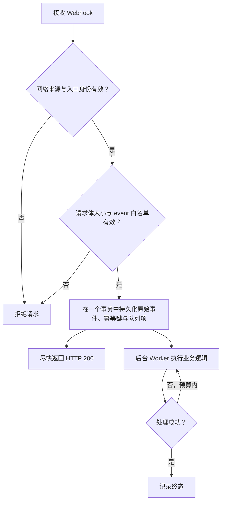

Webhook 支持发送前的同步业务决策，以及已提交消息、离线接收者和在线状态变化的异步通知。业务端通过 HTTP 接收回调。

## 发送前业务回调

`msg.before_send` 是同步回调，在权限检查和 Send 插件之后、消息提交之前执行。默认关闭；独立于异步 Webhook 的 `http_addr`、`focus_events` 和插件开关。各发送入口节点必须部署一致配置，重启后生效。

```toml
[webhook.before_send]
enabled = true
http_addr = "https://business.example.com/im/webhook"
timeout = "500ms"
on_timeout = "deny"
on_error = "deny"
max_in_flight = 256
```

对应环境变量为 `WK_WEBHOOK_BEFORE_SEND_ENABLED`、`WK_WEBHOOK_BEFORE_SEND_HTTP_ADDR`、`WK_WEBHOOK_BEFORE_SEND_TIMEOUT`、`WK_WEBHOOK_BEFORE_SEND_ON_TIMEOUT`、`WK_WEBHOOK_BEFORE_SEND_ON_ERROR`、`WK_WEBHOOK_BEFORE_SEND_MAX_IN_FLIGHT`；环境变量覆盖 TOML。URL 必须为 HTTP(S)，不能包含 userinfo 或 fragment。

```http
POST /im/webhook?event=msg.before_send
Content-Type: application/json
```

```json
{
  "from_uid": "u1",
  "channel_id": "group1",
  "channel_type": 2,
  "client_msg_no": "business-message-001",
  "payload": "aGVsbG8=",
  "no_persist": false,
  "sync_once": false
}
```

`channel_id` 是规范化的源频道标识：单聊使用服务端规范化标识；SyncOnce 使用源频道而非内部命令频道；请求级 `subscribers` 使用同一收件人快照推导出的稳定临时源频道。服务端不会在此时分配已提交的 `message_id` 或 `message_seq`。`payload` 为 Base64；一个群消息每次入口发送尝试只调用一次，不按成员回调，跨节点 authority 转发也不重复调用。

业务端返回 HTTP 200 和一个明确的 JSON 决定：

| 结果 | 响应 |
| --- | --- |
| 原样放行 | `{"allow":true}` |
| 修改后放行 | `{"allow":true,"payload":"bmV3"}` |
| 默认拒绝 | `{"allow":false}` |
| 业务拒绝码 | `{"allow":false,"reason_code":200}` |

`allow` 必填。只允许修改 Payload，不能改变身份或路由字段。省略 `payload` 保留输入；替换内容必须是有效 Base64，解码后为 1–32767 字节。响应体最多 64 KiB，必须是单个 JSON 对象；未知或重复字段、缺少决定、多余 JSON，以及放行响应中的错误字段类型都属于回调错误。业务码范围为 128–255，在 SENDACK 的 `reason_code` 和 Product HTTP 的 `reason` 中保留原值，与 HTTP 状态码无关。省略或填写无效拒绝码时，已解码的拒绝返回标准 NotAllowSend（11）；带有不适用 Payload 的拒绝同样拒绝。

| 情况 | 处理 |
| --- | --- |
| 明确的业务拒绝 | 始终拒绝，无消息提交或投递 |
| 回调超时 | `on_timeout`：`allow` 保留进入回调前的 Payload，`deny` 返回系统错误（15） |
| 网络失败、非 HTTP 200、无法解析出有效决定 | `on_error`：`allow` 保留原 Payload，`deny` 返回系统错误（15） |
| 并发达到 `max_in_flight` | 立即返回系统错误（15），无额外等待队列 |
| 原发送请求取消或期限耗尽 | 终止发送；不会被放行策略覆盖 |

两种失败策略均默认为 `deny`。回调不自动重试、不跟随重定向，不进入异步通知队列。回调期限受发送请求剩余期限约束，应为消息提交留出时间。明确拒绝优先于回调失败放行；发送请求自身取消仍具有最高优先级。

客户端重试可能再次回调。业务端应按发送者、源频道、`client_msg_no` 做幂等；需要重试关联的调用方必须提供稳定且非空的 `client_msg_no`。业务放行不代表随后一定提交成功，不应仅凭此回调完成不可逆扣费等业务事务。NoPersist 和 SyncOnce 同样经过回调，但保留各自的投递、存储语义。

监控 `wukongim_webhook_before_send_total{result}` 和 `wukongim_webhook_before_send_duration_seconds{result}`，区分 `allow`、`reject`、`timeout_allow`、`timeout_deny`、`error_allow`、`error_deny`、`overloaded`、`invalid_request`、`canceled`。指标不包含 UID、频道、回调地址或消息内容。当前只发送 Content-Type，无内置签名或鉴权头；应通过受控网络或代理建立业务端对回调来源的信任。

## 运行 Go 业务回调示例

仓库提供[完整 Go 示例](https://github.com/WuKongIM/WuKongIM/tree/main/docs-site/examples/go-webhook)，只依赖 Go 1.22+ 标准库。它是独立的业务 HTTP 服务，不需要 SDK 或数据库；也可以单独复制 `main.go` 后执行 `go run main.go`。

从包含此功能的源码仓库根目录启动：

```bash
cd docs-site/examples/go-webhook
go run .
```

默认地址是 `http://127.0.0.1:8090/webhook`。可用 `go run . -addr 127.0.0.1:8091` 修改端口；按 Ctrl+C 停止。先在另一个终端验证回调：

```bash
curl -fsS 'http://127.0.0.1:8090/webhook?event=msg.before_send' \
  -H 'Content-Type: application/json' \
  -d '{"from_uid":"alice","channel_id":"example-group","channel_type":2,"client_msg_no":"example-allow","payload":"aGVsbG8="}'
```

预期返回 `{"allow":true}`。更换请求中的 Base64 `payload` 可以验证全部规则：

| 内容 | Base64 Payload | 结果 |
| --- | --- | --- |
| `hello` | `aGVsbG8=` | 原样放行 |
| `[replace] hello` | `W3JlcGxhY2VdIGhlbGxv` | 改写为 `Reviewed: hello` |
| `[reject] hello` | `W3JlamVjdF0gaGVsbG8=` | HTTP 200，`allow=false`、`reason_code=200` |

再将已有 `wukongim.toml` 的发送前回调配置为：

```toml
[webhook.before_send]
enabled = true
http_addr = "http://127.0.0.1:8090/webhook"
timeout = "500ms"
on_timeout = "deny"
on_error = "deny"
max_in_flight = 64
```

重启同一主机上的单节点集群或各入口节点，然后用现有客户端发送上表中的文字。对于 SDK 文本 Payload `{"type":1,"content":"hello"}`，规则作用于 `content`，改写时保留其他 JSON 字段；自定义类型和二进制 Payload 原样放行。Product HTTP 的建群、发送和历史查询命令见示例 README。成功发送的 `reason` 为 1，示例业务拒绝为 200；接收和历史中应看到改写后的内容，拒绝消息没有历史记录。

修改 `main.go` 的 `evaluate` 函数即可替换业务规则。当前规则没有副作用或缓存，相同输入和规则得到相同决定；新增业务写入时需要自行实现持久化幂等，不能把回调放行当作消息已提交。日志只输出决定类型。请求体最多 64 KiB、Payload 最多 32767 字节，每个示例进程最多同时处理 64 个请求，超额返回 HTTP 503。改写后超出 Payload 上限会明确拒绝。

此示例仅接受回环监听地址，用于同机进程联调。其他主机或容器中的 `127.0.0.1` 指向它们自身；跨主机接入需要可达的可信代理及来源鉴权。客户端 Token 鉴权与业务回调鉴权是两件事。

## 在本机验证发送前回调

从包含此功能的源码仓库根目录运行，需要 `go.mod` 指定的 Go 工具链。测试会构建当前源码，自动启动真实三节点集群和回环地址上的可控回调服务；无需 Docker、云服务器或外部 Webhook 地址。

```bash
GOWORK=off go test -tags=e2e ./test/e2e/message/webhook \
  -run '^TestBeforeSendWebhookAuthenticatedFaults$' -count=1 -timeout 2m -p=1 -v
```

此场景启用客户端 Token 鉴权，使用 256 个 Hash Slot、2 个 Slot 副本和每节点 2 个回调并发。回调超时为 3 秒；三节点故意使用不同失败策略，逐项验证 `deny`、超时放行和错误放行。实际部署应保持各节点配置一致。

测试核对客户端鉴权、放行、Payload 替换、业务拒绝、100 ms 慢响应、超时、HTTP 503、无效 JSON、重定向和连接失败。占满一个节点的两个回调名额后，16 次额外发送必须被拒绝且不能进入回调；其他节点仍可发送，释放后原节点也应恢复。成功消息的接收内容与历史记录必须一致，拒绝消息不能进入历史，回调次数与公开指标增量必须符合预期。

`-v` 输出发送延迟、回调并发峰值及测试前后的堆内存和 goroutine 快照。若平台没有进程 CPU 指标，会输出 `unavailable`。这些是有限故障场景的观察值，不是吞吐容量、延迟分位数或长期内存稳定性结论。测试结束会停止进程并清理临时数据。

本机回调使用测试规则，不验证实际业务逻辑，也不验证 Webhook 签名鉴权。接入真实业务服务后，应复用放行、修改、拒绝和失败策略用例验收。

## 启用异步通知

在 `wukongim.toml` 中配置：

```toml
[webhook]
http_addr = "https://events.example.com/wukongim"
focus_events = ["msg.notify", "msg.offline", "user.onlinestatus"]
queue_size = 1024
workers = 16
request_timeout = "5s"
retry_max_attempts = 3
```

服务端会把事件名放在查询参数中：

```text
POST https://events.example.com/wukongim?event=msg.notify
Content-Type: application/json
```

只有 HTTP 200 被视为成功。连接错误、超时或其他状态码会在本次内存任务中有限重试。

## 支持的事件

| 事件 | 请求体 | 用途 |
| --- | --- | --- |
| `msg.before_send` | 单个待发送消息对象 | 同步放行、修改或拒绝 |
| `msg.notify` | 已提交消息数组 | 业务审计、搜索索引、异步通知 |
| `msg.offline` | 一条消息及一批离线 UID | 离线推送候选计算 |
| `user.onlinestatus` | 兼容在线状态字符串数组 | UID Owner 本地、尽力而为的会话提示 |

`msg.notify` 的代表性请求：

```json
[
  {
    "header": {"no_persist": 0, "red_dot": 1, "sync_once": 0},
    "setting": 0,
    "expire": 0,
    "message_id": 123456789,
    "message_idstr": "123456789",
    "client_msg_no": "order-20260730-0001",
    "message_seq": 42,
    "from_uid": "system",
    "channel_id": "u1001",
    "channel_type": 1,
    "timestamp": 1785398400,
    "payload": "eyJ2ZXJzaW9uIjoxLCJ0eXBlIjoib3JkZXJfdXBkYXRlIn0="
  }
]
```

JSON 中的 `payload` 是 Base64。`msg.offline` 在 UID 数量较小时使用 `to_uids`；达到压缩阈值时可能改为 `compress: "gzip"` 与 Base64 编码的 `compress_to_uids`，接收端必须支持两种形式。

`user.onlinestatus` 的每项是：

```text
{uid}-{device_flag}-{online:0|1}-{session_id}-{device_online_count}-{total_online_count}
```

这些计数只来自 UID Owner 当前节点上的活跃 Session，不是集群全局 Presence，也不保证事件完整或有序。UID 可以含 `-`；需要解析时从右侧取最后五个数字段，其余前缀才是 UID。

## 异步通知的可靠性边界

<Callout type="warn" title="Webhook 是有界、尽力而为的">
  队列满、进程退出、请求取消或重试耗尽都可能丢失事件。当前运行时没有磁盘级 Webhook Outbox 或崩溃重放。Webhook 失败不会影响已经成功的 SENDACK 和消息持久化。
</Callout>

推荐的接收端流程：



建议幂等键：

- `msg.notify`：`event + message_id`；
- `msg.offline`：`event + message_id + uid`，逐个接收者去重；
- `user.onlinestatus`：按完整字符串去重，仅作为本地会话提示；不要据此构建全局在线真值。

## 安全

当前 HTTP Sender 只设置 `Content-Type: application/json`，**不会添加签名或共享密钥 Header**。生产环境必须在它之外建立可信边界：

- 使用 HTTPS；
- 优先使用私网、服务网格或出口代理；
- 在反向代理层使用 mTLS、固定出口身份或受控凭据；
- 对来源 IP 和请求速率做限制；
- 不把回调端点暴露为匿名公网写入口；
- 不在日志中记录完整敏感 Payload。

## 容量与失败处理

- `queue_size` 是每类事件内存队列的有界容量。
- `workers` 控制每类队列并发发送数。
- `msg_notify_batch_max_items` 和等待时间控制消息批次。
- `offline_uid_batch_size` 同时控制离线 UID 分块/压缩边界。
- `retry_max_attempts` 是总尝试次数，不是首次之后的额外次数。

接收端持续失败时，应先修复或隔离接收端，而不是无限增大 WuKongIM 内存队列。关键业务数据应能从业务数据库或消息历史重新构建。
