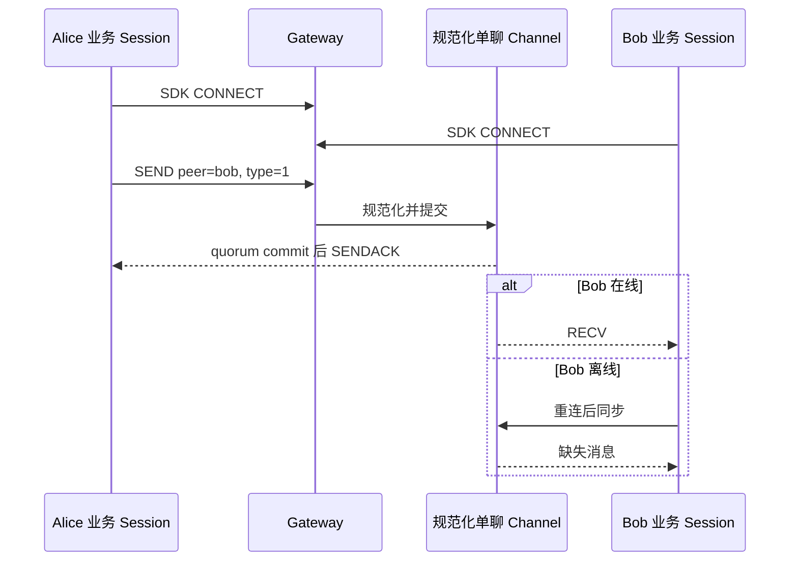

本教程以 `alice` 和 `bob` 为例。最终结果是：两端通过自己的业务身份连接，Alice 向 Bob 的个人 Channel 发送一条持久消息，Bob 可以在线接收，也能在断线后从日志恢复，并管理自己账号的未读状态。

## 开始前

- 完成[启动单节点集群](/zh/guide/quick-start/single-node-cluster)或准备一个测试集群。
- 理解[身份认证](/zh/guide/integration/authentication)的当前 Beta 限制。
- HTTP 示例只能在本地或受保护的业务服务网络中执行。



## 1. 建立业务身份

业务服务应拥有账号登录、好友关系、封禁和内容策略。为两个测试用户选择稳定 UID；不要使用昵称、连接 ID 或设备 ID 代替 UID。

已运行 [Web 双用户示例](/zh/sdk/javascript/quickstart)时，Alice 和 Bob 的凭据已由 BFF 准备，可以直接进入第 2 步。自行接入时，由受信后端保存测试设备 Token；下例使用 Web 设备类别 `device_flag=1`，客户端须保持一致：

```bash
curl -sS http://127.0.0.1:5001/user/token \
  -H 'Content-Type: application/json' \
  -d '{"uid":"alice","token":"alice-local-only","device_flag":1,"device_level":1}'
```

<Callout type="warn" title="内置校验不是完整生产身份系统">
  默认 v3 Beta Gateway 会要求 CONNECT Token 与相同 UID、设备类别的已存 Token 精确匹配。生产发布前仍需保护 `/user/token`、实现过期与轮换策略，并证明错误、撤销和按业务规则过期的 Token 无法连接。
</Callout>

为 Bob 保存独立凭据，然后让两个客户端分别使用自己的 UID、设备标识和 Token 建立连接。没有 SDK 集成时，可以先用[内嵌 Chat Demo](/zh/guide/quick-start/first-message)验证两个浏览器会话。

## 2. 发送个人消息

客户端发送时使用**对端 UID** 作为 `channel_id`，并设置 `channel_type=1`。不要自行拼接或存储服务端内部的单聊频道 ID；服务端会用发送方和接收方 UID 归一化。

受信业务服务也可以用同一语义发送：

本例使用 SDK 内置文本格式，与 Web 示例一致。编码前的 JSON 是：

```json
{"type":1,"content":"hello Bob"}
```

下方 `payload` 是该 JSON 的 UTF-8 Base64。自定义字段和类型需要配套客户端消息解码器，见[自定义消息](/zh/sdk/javascript/advanced/custom-messages)。

```bash
curl -sS http://127.0.0.1:5001/message/send \
  -H 'Content-Type: application/json' \
  -d '{
    "from_uid":"alice",
    "channel_id":"bob",
    "channel_type":1,
    "client_msg_no":"dm-alice-bob-0001",
    "payload":"eyJ0eXBlIjoxLCJjb250ZW50IjoiaGVsbG8gQm9iIn0="
  }'
```

保留稳定且唯一的 `client_msg_no`。网络结果不明确时，用同一个编号重试同一次逻辑发送，不要换编号制造重复消息。HTTP 返回 `reason=1` 表示持久发送到达 频道持久提交；它不表示 Bob 的每台设备都已收到。

## 3. 验证在线与离线结果

在线 Bob 应收到 `RECV` 并在处理后发送 `RECVACK`。再用兼容同步接口验证持久日志；个人频道查询仍使用对端 UID：

```bash
curl -sS http://127.0.0.1:5001/channel/messagesync \
  -H 'Content-Type: application/json' \
  -d '{
    "login_uid":"bob",
    "channel_id":"alice",
    "channel_type":1,
    "start_message_seq":0,
    "limit":20,
    "pull_mode":1
  }'
```

响应中的 `channel_id` 会映射回 `alice`，`message_seq` 只在这一个 person Channel 内有序。客户端应按消息 ID、`client_msg_no` 和 Channel sequence 合并在线投递与重连同步，允许重复到达。

## 4. 检查会话和未读

```bash
curl -sS http://127.0.0.1:5001/conversation/list \
  -H 'Content-Type: application/json' \
  -d '{"uid":"bob","limit":20}'
```

Bob 的会话项使用 `channel_id=alice`。`unread` 根据 Bob 在该频道的已读位置和可见消息计算，不是所有设备收到消息的总次数。用户确认当前会话已读后，由受信边界调用：

```bash
curl -sS http://127.0.0.1:5001/conversations/clearUnread \
  -H 'Content-Type: application/json' \
  -d '{"uid":"bob","channel_id":"alice","channel_type":1}'
```

`clearUnread` 会把 Bob 的已读位置（`read_seq`）推进到最新已提交的普通消息。因此操作期间新到达的消息也可能一起被清除红点；这不会向 Alice 证明 Bob 实际阅读了哪些消息。同一 UID 的其他设备在同步后也会看到更新。

## 5. 验证多设备与恢复

1. 用不同 `device_id` 建立 Bob 的第二个 Session。
2. 明确产品的主/从设备冲突策略，不把“同 UID”理解为“只有一条连接”。
3. 断开其中一个设备，再发送一条新的持久消息。
4. 重连后通过 SDK 同步或 `/channel/messagesync` 恢复缺失 sequence。
5. 验证在线投递、离线恢复和 账号未读状态不会被当成同一个完成信号。

上线前还要测试好友解除、黑名单、Token 撤销、断线重试、重复发送、热点单聊分布和 Webhook 重复消费。继续阅读[群聊与超大群](/zh/guide/tutorials/large-groups)或[消息收发](/zh/guide/integration/messaging)。
